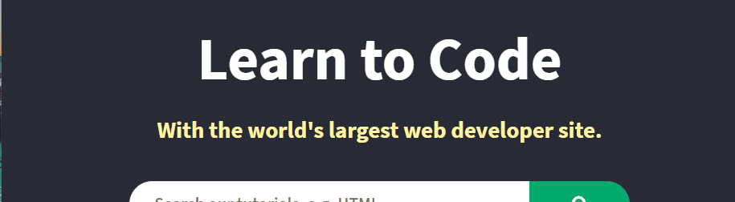

# Projeto com README
Um projeto de teste com um arquivo README 🙌

[](https://www.w3schools.com/)

## Tecnologias utilizadas
- HTML
- CSS
- JS

## Como utilizar

1 - Clone o projeto
```
git clone <URL>
```

2 - Acesse a pasta do projeto
```
cd repositorio-com-readme
```
